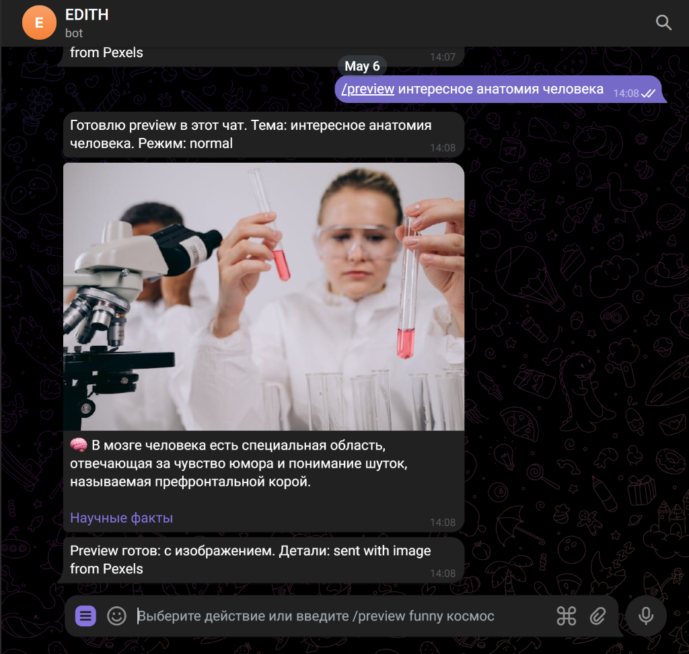

# AutoPostingTG

Telegram-бот для автопостинга научно-популярных фактов: генерирует короткий факт, подбирает тематическое изображение и публикует пост в Telegram-канал.

## Реализовано в Mini App

- Мультиканальность: несколько каналов с индивидуальными темами, расписанием и медиа-политикой («Ещё» → «Каналы»).
- Темы и режим текста для каждого слота расписания («утром — факты, вечером — юмор»).
- Пул тем с ротацией без повторов (настраивается в карточке канала).
- Очередь предпросмотра: посты генерируются заранее, их можно одобрить, отредактировать или отклонить до публикации (вкладка «Очередь»).
- Медиа-политика канала: фото включены по умолчанию, AI-генерация изображений (при наличии ключа Gemini) или полностью без фото. Своё фото/видео можно прикрепить по URL в очереди.
- Статистика: подписчики отслеживаются ежеминутно (запись в БД — при изменении числа + часовой heartbeat), активность постинга, разбивка по темам, использование провайдеров.
- Редактирование перед публикацией: текст из предпросмотра генератора можно поправить и опубликовать именно отредактированную версию.
- Уведомления в личку: бот пишет владельцу о публикации поста по расписанию, о подготовленном посте в очереди и об ошибках (провайдеры недоступны, публикация не вышла).

## Настройка через команды бота

Всё, что настраивается в Mini App, можно настроить и командами в чате с ботом (нужен `DATABASE_URL`; `.env` остаётся источником значений по умолчанию):

| Команда | Что делает |
|---|---|
| `/setup` | Обзор текущей настройки: канал, тема, режим, медиа, расписание, пул тем |
| `/channels` | Список каналов (→ отмечен выбранный для настройки) |
| `/addchannel @канал [тема]` | Добавить канал и выбрать его |
| `/usechannel N` | Переключить канал для команд настройки |
| `/settopic <тема>` | Тема канала по умолчанию |
| `/setmode <режим>` | Режим текста: normal / funny / wow / strict |
| `/setmedia auto\|ai\|off` | Медиа-политика: стоковые фото / AI-изображения / без фото |
| `/times` | Показать расписание |
| `/addtime ЧЧ:ММ [тема] [режим]` | Добавить слот (тема и режим слота — опциональны) |
| `/deltime ЧЧ:ММ` | Удалить слот |
| `/topics` | Пул тем с ротацией без повторов |
| `/addtopic <тема>` / `/deltopic N` | Управление пулом тем |

Пример быстрого старта в чате с ботом:

```text
/addchannel @my_science_channel космос
/addtime 09:00
/addtime 19:30 история wow
/addtopic глубокий океан
/setup
```

## Тест через v0 API

Для проверки цепочки «ключ → генерация → публикация» можно использовать [v0 Model API](https://v0.app/settings/api-keys) (OpenAI-совместимый):

- через Mini App: «Ещё» → «API-ключи» → провайдер «v0 (Vercel)» — вставьте ключ `v0:...`;
- или через `.env`:

```env
V0_API_KEY=v0:...
V0_MODELS=v0-1.5-md
```

Учтите: модели v0 оптимизированы под код, качество текстов постов будет ниже, чем у Gemini/Groq — используйте для теста, а не для продакшена.

## Демонстрация

> Скриншоты нужно положить в `docs/screenshots/`. Имена ниже уже подготовлены под README.

### `/preview`



Команда отправляет тестовый пост в личный чат с ботом. Используется для проверки текста, картинки, режима и ссылок перед публикацией в канал.

```text
/preview космос
/preview funny деревья
/preview wow япония
```

### `/menu`


Команда включает кнопки Telegram-меню. Кнопки используют `DEFAULT_TOPIC` и `DEFAULT_MODE`, поэтому для точной темы лучше писать команду вручную.

Кнопки:

- `🔎 Preview` - тестовый пост в личный чат.
- `🚀 Post` - публикация в канал.
- `⚙️ Test` - проверка конфигурации.
- `🎛 Modes` - список режимов генерации.
- `❓ Help` - справка.

```text
/menu
```

### `/post`


Команда публикует готовый пост в Telegram-канал, указанный в `CHANNEL_ID`.

```text
/post космос
/post funny деревья
/post strict биология
```

### `/test`


Команда показывает текущую конфигурацию: включён ли Telegram proxy, какие LLM-провайдеры доступны, какие image API подключены и какой режим используется по умолчанию.

```text
/test
```

## Работает ли без VPN

Коротко: **в России без VPN/proxy проект, скорее всего, не будет работать стабильно**.

Причина: бот должен подключаться к `api.telegram.org`, а также к внешним LLM и image API. В тестовой среде прямое подключение к Telegram Bot API падало по timeout, поэтому был добавлен proxy-режим.

Проект поддерживает оба варианта:

- **Без VPN/proxy**: работает, если с вашей сети доступны `api.telegram.org`, LLM API и image API.
- **С VPN/proxy**: рекомендуемый режим для РФ. Укажите proxy в `.env`.

Пример для локального HTTP proxy:

```env
TELEGRAM_PROXY_URL=http://127.0.0.1:10809
OUTBOUND_PROXY_URL=http://127.0.0.1:10809
```

Пример для SOCKS5:

```env
TELEGRAM_PROXY_URL=socks5://127.0.0.1:10808
OUTBOUND_PROXY_URL=socks5://127.0.0.1:10808
```

`TELEGRAM_PROXY_URL` используется для Telegram. `OUTBOUND_PROXY_URL` используется для LLM и image API. Если `OUTBOUND_PROXY_URL` пустой, бот использует `TELEGRAM_PROXY_URL`.

## Установка

1. Склонировать репозиторий:

```powershell
git clone https://github.com/vladkorkishkooff-tech/AutoPostingTG.git
cd AutoPostingTG
```

2. Создать виртуальное окружение:

```powershell
python -m venv .venv
.\.venv\Scripts\Activate.ps1
```

3. Установить зависимости:

```powershell
python -m pip install -r requirements.txt
```

4. Создать `.env`:

```powershell
Copy-Item .env.example .env
```

5. Заполнить минимум:

```env
BOT_TOKEN=токен_бота_из_BotFather
CHANNEL_ID=@username_канала
CHANNEL_URL=https://t.me/username_канала
```

6. Добавить бота администратором Telegram-канала с правом публикации.

7. Запустить:

```powershell
python main.py
```

8. Проверить в Telegram:

```text
/test
/preview космос
/post космос
```

## Бесплатный и платный путь

Этот проект показывает **бесплатный путь к автопостингу**: бесплатные или условно бесплатные LLM API, бесплатные image API, fallback-логика и proxy для обхода сетевых ограничений.

Минус бесплатного пути: он сложнее в настройке и менее стабилен. Возможны лимиты, `403/429`, недоступность моделей, нестабильные image API и необходимость VPN/proxy.

Более удобный платный путь:

- Использовать стабильные платные модели: Gemini, OpenAI, Claude, Mistral, платный OpenRouter или другие API.
- Подключить платный image provider или заранее подготовленную медиабазу.
- Разместить бота на VPS в регионе, где Telegram Bot API и выбранные AI API доступны без локального VPN.

Платный вариант проще в эксплуатации: меньше fallback-ошибок, выше качество текста, стабильнее генерация и меньше ручной настройки сети.

В `.env.example` есть закомментированный блок “Платный путь”. Его можно раскомментировать, вставить свои ключи и поднять нужный провайдер выше в `LLM_PROVIDER_ORDER`.

## Настройка API

Бот работает даже без внешнего LLM API: если все модели недоступны, включается локальный fallback с готовыми фактами.

Рекомендуемый бесплатный старт:

```env
GROQ_API_KEY=...
GROQ_MODELS=llama-3.1-8b-instant,llama-3.3-70b-versatile,gemma2-9b-it,qwen/qwen3-32b
LLM_PROVIDER_ORDER=groq,nvidia,openrouter,local
```

Цепочка работает слева направо. Если одна модель вернула лимит, `403`, `429` или сетевую ошибку, бот переходит к следующей модели или провайдеру.

Изображения:

```env
NASA_API_KEY=DEMO_KEY
PIXABAY_API_KEY=
PEXELS_API_KEY=
UNSPLASH_ACCESS_KEY=
```

Если все image API недоступны, бот создаёт простую тематическую fallback-картинку без текста.

## Защита от повторов

Бот ведёт локальную историю публикаций в `data/content_history.json`. Файл не коммитится в GitHub, потому что это runtime-состояние конкретного запуска.

История используется для двух вещей:

- не повторять недавние тексты по той же теме и режиму;
- не использовать недавно отправленные URL изображений по той же теме.

Настройки:

```env
HISTORY_FILE=data/content_history.json
HISTORY_LIMIT=500
RECENT_POST_LIMIT=40
RECENT_IMAGE_LIMIT=60
GENERATION_ATTEMPTS=4
```

Если посты всё ещё повторяются, увеличьте `RECENT_POST_LIMIT` и `GENERATION_ATTEMPTS`. Если повторяются фотографии, увеличьте `RECENT_IMAGE_LIMIT`.

## Режимы постов

Поддерживаются режимы:

- `normal` / `обычный` - нейтральный короткий факт.
- `funny` / `смешной` - факт с лёгкой иронией.
- `wow` / `интересный` - факт с акцентом на удивление.
- `strict` / `строгий` - сухой информативный стиль.

Примеры:

```text
/preview normal космос
/preview funny деревья
/preview wow япония
/preview strict биология
```

Режим по умолчанию:

```env
DEFAULT_MODE=normal
```

## Стиль под эталонный пост

Для портфолио и реального ведения канала не обязательно сразу fine-tune модель. В проекте уже есть быстрый способ “обучить” стиль через эталон в prompt:

```env
POST_STYLE_EXAMPLE=🤬 В японском языке нет ругательств сильнее, чем «дурак» и «идиот»
```

Модель не копирует этот текст буквально. Она использует его как ориентир по длине, плотности и подаче.

Когда появится набор эталонов, можно собрать датасет:

```jsonl
{"messages":[{"role":"user","content":"Тема: японский язык. Режим: normal"},{"role":"assistant","content":"🤬 В японском языке нет ругательств сильнее, чем «дурак» и «идиот»"}]}
{"messages":[{"role":"user","content":"Тема: деревья. Режим: wow"},{"role":"assistant","content":"🌲 Годичные кольца дерева отражают условия роста: широкие появляются в благоприятные годы, узкие — при стрессе или засухе"}]}
```

Где делать настоящее fine-tuning:

- [Mistral Fine-tuning](https://docs.mistral.ai/capabilities/finetuning/text_vision_finetuning/) - fine-tuning через AI Studio или API, датасет в JSONL.
- [Hugging Face TRL SFTTrainer](https://huggingface.co/docs/trl/main/sft_trainer) - самостоятельное supervised fine-tuning open-source моделей, например Qwen/Llama.
- [OpenAI fine-tuning guide](https://help.openai.com/en/articles/11162441-how-can-i-get-started-with-fine-tuning) - fine-tuning через OpenAI API, если доступен аккаунт и регион.

Практичный путь для этого проекта: сначала собрать 50-200 хороших постов, затем использовать их либо как `POST_STYLE_EXAMPLE`/few-shot prompt, либо как JSONL-датасет для fine-tuning.

## Основные настройки `.env`

```env
BOT_TOKEN=
CHANNEL_ID=@your_channel
CHANNEL_URL=https://t.me/your_channel

TELEGRAM_PROXY_URL=
OUTBOUND_PROXY_URL=

DEFAULT_TOPIC=наука
DEFAULT_MODE=normal
POST_STYLE_EXAMPLE=🤬 В японском языке нет ругательств сильнее, чем «дурак» и «идиот»

LLM_PROVIDER_ORDER=groq,nvidia,openrouter,local
POST_INTERVAL_HOURS=24
POST_ON_STARTUP=false
DISABLE_PERIODIC_POSTING=false
ADMIN_USER_IDS=
```

Если `ADMIN_USER_IDS` пустой, командами может пользоваться любой пользователь, который написал боту. Для реального канала лучше указать Telegram user id администраторов:

```env
ADMIN_USER_IDS=123456789,987654321
```

## Структура проекта

```text
main.py              # Telegram-бот, команды, публикация
config.py            # Загрузка и нормализация .env
ai_gen.py            # LLM-провайдеры, режимы, style example, local fallback
image_fetcher.py     # Поиск и скачивание изображений, fallback-картинка
content_history.py   # История постов и изображений для защиты от повторов
requirements.txt     # Зависимости
.env.example         # Шаблон конфигурации
docs/screenshots/    # Скриншоты для README
```
